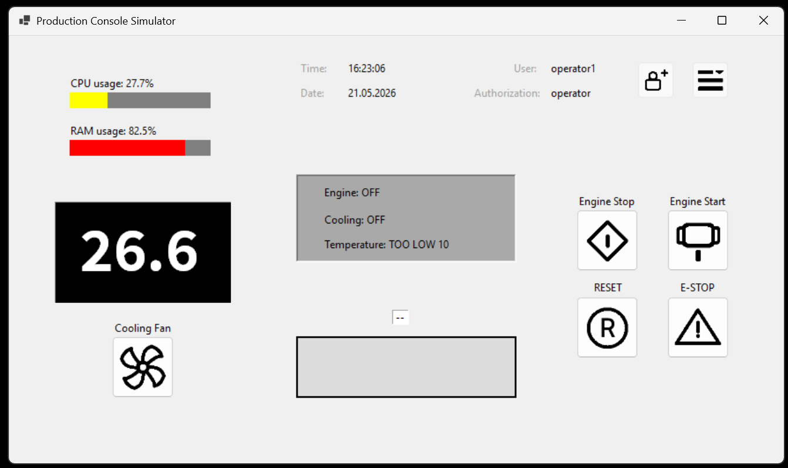
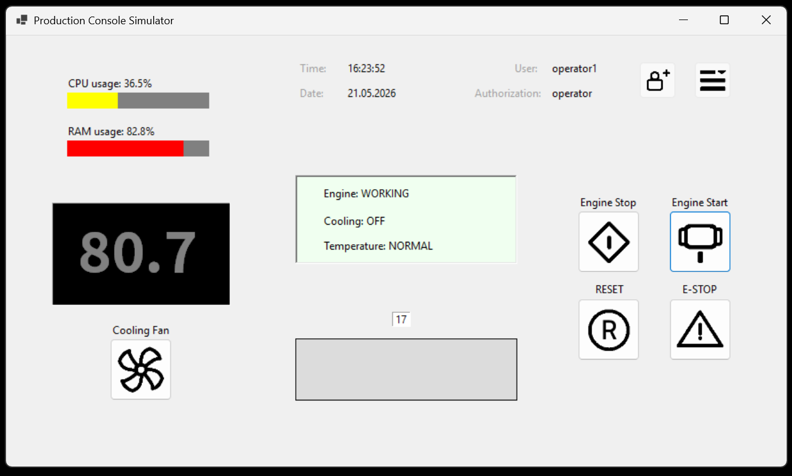
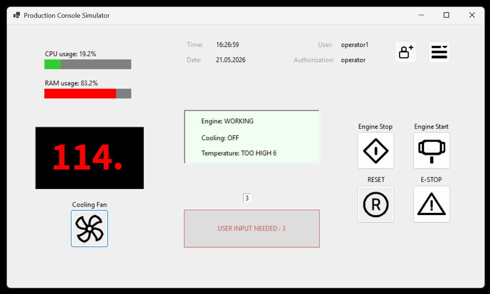
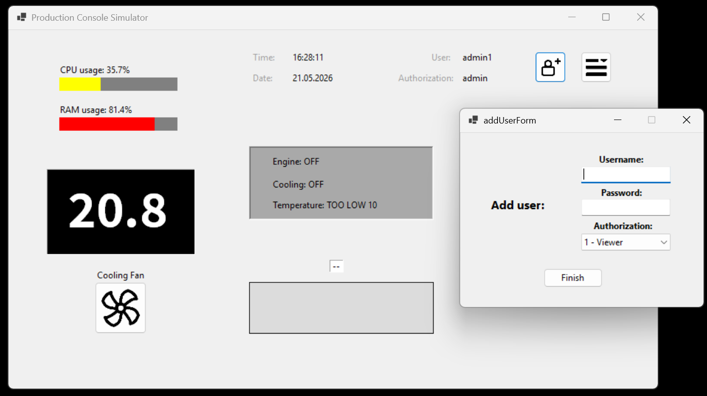

# Production Line Simulator

A Control Desk Simulator of a "Production Line" developed using **.NET Windows Forms (C#)** technology. The application simulates the operation of a control panel in an industrial plant, integrating a supervisory system for the technical parameters of a machine (motor) with an operator alertness self-diagnosis system  (dead man's switch) and PC hardware diagnostics.

## Features

* **Thermal Process Simulation**: A realistic model of motor temperature changes based on its operational state (WORKING/OFF) and the activation of the cooling fan. A random noise generator has been introduced to make the simulation more realistic.
* **Automatic Safety Systems**: 
    * Immediate emergency shutdown (Machine Stop) upon exceeding a critical temperature of 140°C.
    * A warning timer that shuts down the process if operations run under sub-optimal conditions (<45°C or >95°C) for longer than 10 seconds.
* **Operator Self-Diagnosis (Dead Man's Switch)**: A system verifying the presence and alertness of the operator. Interaction (clicking a button) is required every 30 seconds. A lack of response triggers an 11-second alarm countdown, after which the production line safely shuts down.
* **PC System Diagnostics**: Real-time monitoring of CPU and RAM utilization with dynamic progress bar visualization (colors: green, yellow, red) using the `LibreHardwareMonitor` library.
* **Authorization & Role Management System**: A login screen that verifies credentials against a local JSON database (`users.json`). Three access levels are supported:
    1. **Viewer**: Read-only access to parameters; execution buttons are disabled.
    2. **Operator**: Full control over the line (Motor Start/Stop, cooling fan, reset, E-STOP).
    3. **Admin**: Operator privileges + access to user account management (adding/editing accounts).

---

## 📂 Project File Structure

The project has been organized according to best practices regarding the separation of source code and documentation:

```text
ProductionLineSimulator/
├── .git/                    
├── .vs/                     
├── docs/                    # Project documentation
├── src/                     # Application source code (.NET)
│   ├── Assets/              # Graphical resources and icons
│   ├── Properties/          # Assembly properties and configuration
│   ├── addUserForm.cs       # Form for adding new users
│   ├── editUsersForm.cs      # Form for modifying and deleting accounts
│   ├── loginForm.cs         # Login window and User class definition
│   ├── mainForm.cs          # Main control panel (logic and timers)
│   ├── Program.cs           # Application entry point (Main)
│   ├── productionLine.csproj  # C# project file
│   └── users.json           # Local user database (JSON)
├── .gitignore               
├── LICENCE.md               
├── productionLine.slnx      # New Visual Studio Solution file format
└── README.md                
```

---

## Preview

| Idle State & Low Temperature Warning | Normal Operation |
| :---: | :---: |
| <br>*The control panel when the engine is turned OFF and the temperature is sub-optimal.* | <br>*The system operating within the optimal temperature range with an 'Operator' access level.* |
| **Critical State & Operator Verification** | **User Management (Admin Privileges)** |
| <br>*The interface showing elevated temperatures alongside the active Dead Man's Switch countdown.* | <br>*The management window for adding new users, accessible exclusively with Administrator privileges.* |

---

## System Requirements
To compile and run the project, you will need:
* Operating System: **Windows 10 / 11**
* Runtime Environment: **.NET 6.0 SDK** or newer
* IDE: **Visual Studio 2022** (recommended) or **Rider**

---

## Download and Run

### Running via Visual Studio
1. Open the solution file `productionLine.slnx` in Visual Studio 2022.
2. Wait for the NuGet packages to restore (specifically `LibreHardwareMonitor.Hardware`).
3. Ensure that the `productionLine` project is set as the startup project and press **F5** (or the *Start* button) to build and run the application.

### Running via Command Line Interface (CLI)
Navigate to the project's root source directory and build/run it using the .NET CLI:
```bash
cd src
dotnet restore
dotnet run
```

---

## 🔐 Login and Test Accounts

The user database is located in the `src/users.json` file. Below are the default login credentials for each access level (provided the JSON file has been initialized):

| Role | Username | Password |
| :--- | :--- | :--- |
| **Administrator** | `admin` | *(Check users.json)* |
| **Operator** | `operator` | *(Check users.json)* |
| **Viewer** | `viewer` | *(Check users.json)* |

*New accounts can be added and modified directly within the application interface after logging into an account with Administrator privileges (Level 3).*


